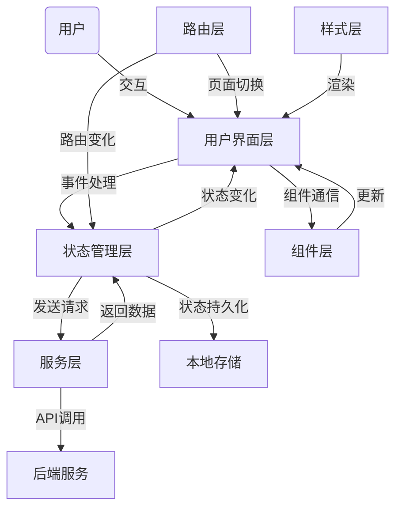

# 如何将 Wiki 内容添加到 GitHub

本指南将帮助您将前端文档添加到 GitHub Wiki。

## 方法一：通过 GitHub 网页界面添加

1. **访问您的 GitHub 仓库**
   - 打开浏览器，登录 GitHub 账户
   - 导航到您的项目仓库

2. **启用 Wiki 功能**
   - 点击仓库页面顶部的 "Settings" 标签
   - 在左侧菜单中找到 "Features" 部分
   - 确保 "Wikis" 选项已启用 (勾选)

3. **访问 Wiki 页面**
   - 返回仓库主页
   - 点击顶部的 "Wiki" 标签

4. **创建主页**
   - 如果这是您第一次使用 Wiki，您会看到 "Create the first page" 按钮
   - 点击该按钮创建主页
   - 如果 Wiki 已存在，点击 "New Page" 按钮创建新页面

5. **添加内容**
   - 页面标题填写 "Frontend Documentation" 或 "前端文档"
   - 在编辑框中粘贴 `Frontend-Wiki.md` 文件的全部内容
   - 您可以在编辑器上方选择 Markdown 格式

6. **保存页面**
   - 在页面底部添加提交消息，如 "添加前端文档"
   - 点击 "Save Page" 按钮

7. **添加其他页面**
   - 根据需要，您可以创建更多页面
   - 使用侧边栏在页面间建立导航链接

## 方法二：通过 Git 克隆并推送 Wiki (推荐)

1. **克隆 Wiki 仓库**
   ```bash
   # 替换 <username>/<repo> 为您的用户名和仓库名
   git clone https://github.com/<username>/<repo>.wiki.git
   cd <repo>.wiki
   ```

2. **添加 Wiki 文件**
   ```bash
   # 将之前创建的 Wiki 文件复制到 Wiki 仓库
   cp ../Frontend-Wiki.md Home.md  # 作为 Wiki 首页
   # 或者保持原名
   cp ../Frontend-Wiki.md "Frontend-Documentation.md"
   
   # 如果需要添加图片等媒体文件
   mkdir -p images
   cp ../frontend_system_diagram.html images/
   ```

3. **编辑文件链接**
   - 如果需要，更新文档中的链接以正确指向其他 Wiki 页面或图像

4. **提交并推送更改**
   ```bash
   git add .
   git commit -m "添加前端文档"
   git push origin master
   ```

5. **验证 Wiki 内容**
   - 访问您的 GitHub 仓库
   - 点击 "Wiki" 标签查看您的内容

## 添加系统架构图

由于 GitHub Wiki 不直接支持 HTML 文件嵌入，对于系统架构图，您有以下选项：

1. **将 HTML 转换为图像**
   - 在浏览器中打开 `frontend_system_diagram.html`
   - 截屏或保存为图片格式 (PNG, JPG)
   - 将图片上传到 Wiki 仓库的 `images` 文件夹
   - 在 Wiki 页面中使用 `` 引用图片

2. **使用 GitHub Gist 或外部服务**
   - 将 HTML 文件内容上传到 GitHub Gist
   - 在 Wiki 页面中提供 Gist 链接

3. **直接在 Wiki 中使用 Mermaid 语法**
   - GitHub Wiki 支持 Mermaid 图表
   - 将 HTML 文件中的 Mermaid 代码部分提取出来
   - 在 Wiki 页面中使用 Mermaid 代码块

```markdown

```

## 最佳实践

1. **保持文档的更新**
   - 每当前端代码有重大变更时，及时更新 Wiki 文档
   - 指定团队成员负责文档维护

2. **建立文档结构**
   - 使用目录和章节让文档易于导航
   - 针对不同用户角色创建专门的页面 (如开发者、设计师、测试人员)

3. **添加目录**
   - 在较长的页面顶部添加目录，方便读者快速定位信息

4. **链接相关资源**
   - 在适当的地方添加指向官方文档、教程等外部资源的链接
   - 链接到仓库中的代码示例

5. **使用标签和分类**
   - 为不同类型的文档内容添加标签，方便搜索和过滤 