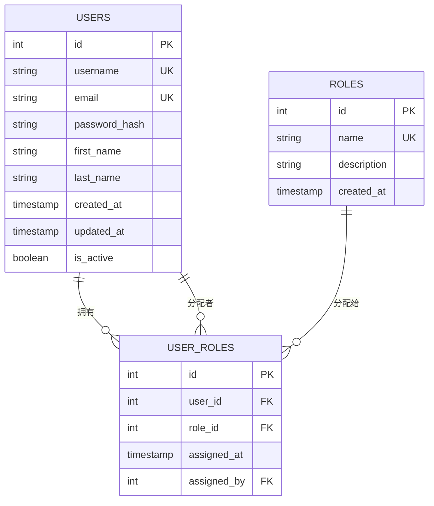
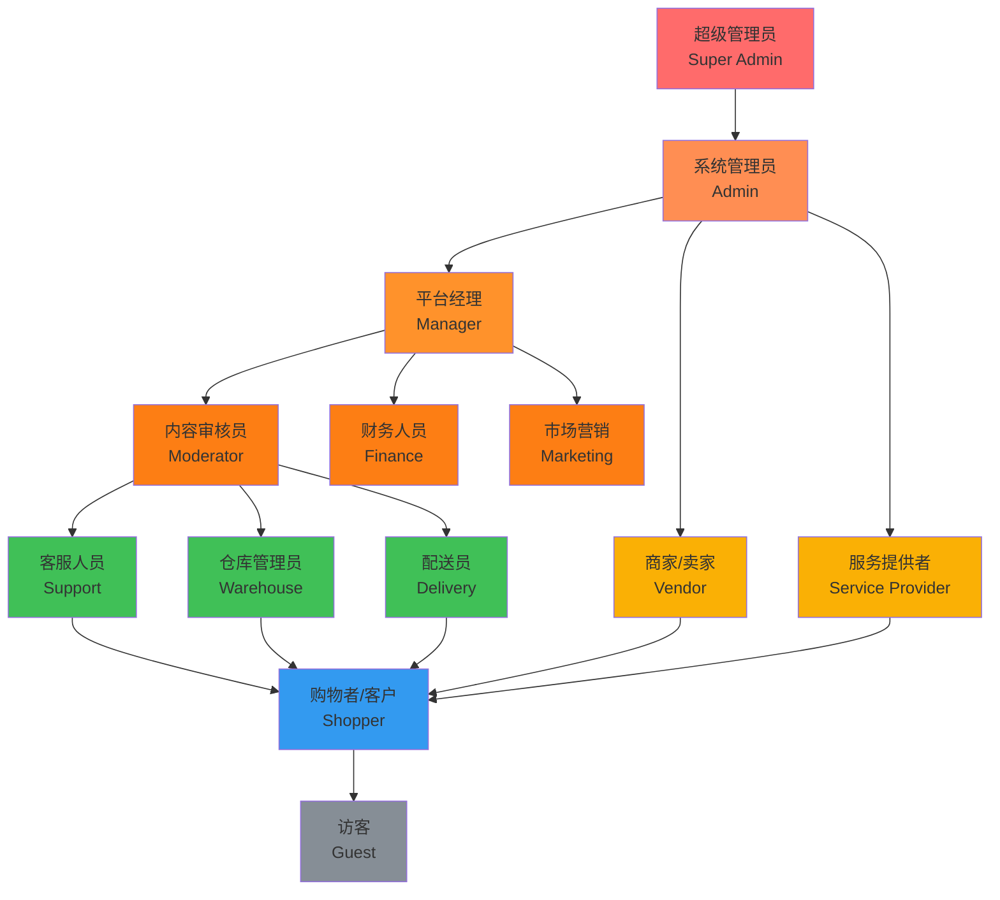
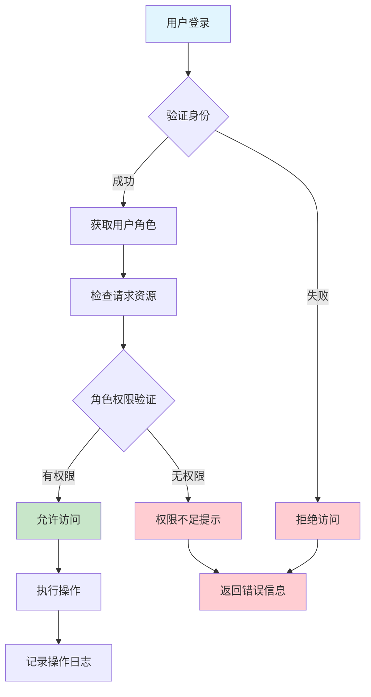

# 用户角色与权限控制系统 Wiki

## 概述

Tigu平台采用基于角色的访问控制（RBAC）系统，通过角色分配来管理用户权限。系统支持多角色分配，用户可以同时拥有多个角色。

## 数据库设计

### 核心表结构

#### 1. `users` 表 - 用户基础信息
```sql
CREATE TABLE users (
    id SERIAL PRIMARY KEY,
    username VARCHAR(50) UNIQUE NOT NULL,
    email VARCHAR(255) UNIQUE NOT NULL,
    password_hash VARCHAR(255) NOT NULL,
    first_name VARCHAR(50),
    last_name VARCHAR(50),
    created_at TIMESTAMP DEFAULT CURRENT_TIMESTAMP,
    updated_at TIMESTAMP DEFAULT CURRENT_TIMESTAMP,
    is_active BOOLEAN DEFAULT TRUE
);
```

#### 2. `roles` 表 - 角色定义
```sql
CREATE TABLE roles (
    id SERIAL PRIMARY KEY,
    name VARCHAR(50) UNIQUE NOT NULL,
    description TEXT,
    created_at TIMESTAMP DEFAULT CURRENT_TIMESTAMP
);
```

#### 3. `user_roles` 表 - 用户角色关联（多对多关系）
```sql
CREATE TABLE user_roles (
    id SERIAL PRIMARY KEY,
    user_id BIGINT NOT NULL REFERENCES users(id) ON DELETE CASCADE,
    role_id INTEGER NOT NULL REFERENCES roles(id) ON DELETE CASCADE,
    assigned_at TIMESTAMP DEFAULT CURRENT_TIMESTAMP,
    assigned_by INTEGER REFERENCES users(id),
    UNIQUE(user_id, role_id)
);
```

### 数据库关系图



## 系统角色定义

### 1. 管理员角色 (admin)
- **权限级别**: 最高级
- **主要功能**:
  - 系统全部权限
  - 用户管理（创建、删除、修改用户）
  - 角色管理（分配、撤销角色）
  - 系统配置管理
  - 数据库备份与恢复
  - 系统监控与日志查看

### 2. 平台经理 (manager)
- **权限级别**: 高级
- **主要功能**:
  - 业务运营管理
  - 内容审核与管理
  - 数据分析与报表
  - 商家审核与管理
  - 平台政策制定
  - 客户服务监督

### 3. 商家/卖家 (vendor)
- **权限级别**: 中级
- **主要功能**:
  - 商品上架与管理
  - 库存管理
  - 订单处理
  - 店铺装修
  - 销售数据查看
  - 客户咨询回复

### 4. 服务提供者 (service_provider)
- **权限级别**: 中级
- **主要功能**:
  - 服务项目发布
  - 服务预约管理
  - 服务时间安排
  - 客户评价查看
  - 收入统计查看

### 5. 配送员 (delivery)
- **权限级别**: 基础
- **主要功能**:
  - 配送任务接收
  - 配送状态更新
  - 路线规划查看
  - 配送历史记录
  - 收入结算查看

### 6. 购物者/客户 (shopper)
- **权限级别**: 基础
- **主要功能**:
  - 商品浏览与搜索
  - 购物车管理
  - 下单与支付
  - 订单查看与跟踪
  - 评价与反馈
  - 个人信息管理

### 7. 内容审核员 (moderator)
- **权限级别**: 中级
- **主要功能**:
  - 商品信息审核
  - 用户评价审核
  - 举报内容处理
  - 违规内容下架

### 8. 客服人员 (support)
- **权限级别**: 基础
- **主要功能**:
  - 客户问题处理
  - 订单问题协调
  - 退换货处理
  - 用户投诉记录

### 9. 财务人员 (finance)
- **权限级别**: 中级
- **主要功能**:
  - 财务报表查看
  - 交易记录管理
  - 佣金结算
  - 退款处理
  - 税务管理

### 10. 市场营销 (marketing)
- **权限级别**: 中级
- **主要功能**:
  - 促销活动管理
  - 广告投放管理
  - 数据分析报告
  - 用户行为分析

### 11. 仓库管理员 (warehouse)
- **权限级别**: 基础
- **主要功能**:
  - 库存盘点
  - 货物入库出库
  - 库存预警管理
  - 商品分拣

### 12. 访客 (guest)
- **权限级别**: 最低
- **主要功能**:
  - 商品浏览（部分）
  - 基础搜索
  - 注册登录

## 权限层级结构图



## 角色权限矩阵

| 功能模块 | Admin | Manager | Vendor | Service | Delivery | Shopper | Moderator | Support | Finance | Marketing | Warehouse | Guest |
|---------|-------|---------|--------|---------|----------|---------|-----------|---------|---------|-----------|-----------|-------|
| 用户管理 | ✅ | ✅ | ❌ | ❌ | ❌ | ❌ | ❌ | ❌ | ❌ | ❌ | ❌ | ❌ |
| 角色管理 | ✅ | ✅ | ❌ | ❌ | ❌ | ❌ | ❌ | ❌ | ❌ | ❌ | ❌ | ❌ |
| 商品管理 | ✅ | ✅ | ✅ | ❌ | ❌ | ❌ | ✅ | ❌ | ❌ | ✅ | ✅ | ❌ |
| 订单管理 | ✅ | ✅ | ✅ | ✅ | ✅ | ✅ | ❌ | ✅ | ✅ | ❌ | ✅ | ❌ |
| 支付管理 | ✅ | ✅ | ✅ | ✅ | ❌ | ✅ | ❌ | ✅ | ✅ | ❌ | ❌ | ❌ |
| 配送管理 | ✅ | ✅ | ✅ | ❌ | ✅ | ✅ | ❌ | ✅ | ❌ | ❌ | ✅ | ❌ |
| 财务报表 | ✅ | ✅ | ✅ | ✅ | ✅ | ❌ | ❌ | ❌ | ✅ | ✅ | ❌ | ❌ |
| 内容审核 | ✅ | ✅ | ❌ | ❌ | ❌ | ❌ | ✅ | ❌ | ❌ | ❌ | ❌ | ❌ |
| 客户服务 | ✅ | ✅ | ✅ | ✅ | ❌ | ❌ | ❌ | ✅ | ❌ | ❌ | ❌ | ❌ |
| 商品浏览 | ✅ | ✅ | ✅ | ✅ | ✅ | ✅ | ✅ | ✅ | ✅ | ✅ | ✅ | ✅ |

## 实现示例

### 1. 初始化角色数据

```sql
-- 插入基础角色
INSERT INTO roles (name, description) VALUES
('admin', '系统管理员，拥有全部权限'),
('manager', '平台经理，负责业务运营管理'),
('vendor', '商家卖家，可以发布和管理商品'),
('service_provider', '服务提供者，提供各类服务'),
('delivery', '配送员，负责订单配送'),
('shopper', '购物用户，可以购买商品和服务'),
('moderator', '内容审核员，负责内容审核'),
('support', '客服人员，处理客户问题'),
('finance', '财务人员，管理财务相关事务'),
('marketing', '市场营销人员，负责推广活动'),
('warehouse', '仓库管理员，管理库存'),
('guest', '访客，未注册用户');
```

### 2. 分配用户角色

```sql
-- 为用户分配角色
INSERT INTO user_roles (user_id, role_id, assigned_by) VALUES
(1, 1, 1),  -- 用户1分配为管理员
(2, 3, 1),  -- 用户2分配为商家
(3, 6, 1);  -- 用户3分配为购物者
```

### 3. 查询用户角色

```sql
-- 查询用户的所有角色
SELECT 
    u.username,
    r.name as role_name,
    r.description as role_description,
    ur.assigned_at
FROM users u
JOIN user_roles ur ON u.id = ur.user_id
JOIN roles r ON ur.role_id = r.id
WHERE u.id = ?;
```

### 4. 检查用户权限

```sql
-- 检查用户是否具有特定角色
SELECT EXISTS(
    SELECT 1 
    FROM user_roles ur
    JOIN roles r ON ur.role_id = r.id
    WHERE ur.user_id = ? AND r.name = 'admin'
) as has_admin_role;
```

## 权限控制流程图



## API 接口权限控制

### 装饰器实现示例 (Python/FastAPI)

```python
from functools import wraps
from fastapi import HTTPException, Depends
from typing import List

def require_roles(allowed_roles: List[str]):
    def decorator(func):
        @wraps(func)
        async def wrapper(*args, **kwargs):
            current_user = kwargs.get('current_user')
            if not current_user:
                raise HTTPException(status_code=401, detail="未登录")
            
            user_roles = await get_user_roles(current_user.id)
            user_role_names = [role.name for role in user_roles]
            
            if not any(role in allowed_roles for role in user_role_names):
                raise HTTPException(status_code=403, detail="权限不足")
            
            return await func(*args, **kwargs)
        return wrapper
    return decorator

# 使用示例
@app.get("/admin/users")
@require_roles(["admin", "manager"])
async def get_all_users(current_user: User = Depends(get_current_user)):
    # 只有管理员和经理可以访问
    pass
```

## 前端权限控制

### Vue.js 组件权限控制

```typescript
// composables/usePermissions.ts
import { computed } from 'vue'
import { useAuthStore } from '@/stores/auth'

export function usePermissions() {
  const authStore = useAuthStore()
  
  const hasRole = (role: string) => {
    return authStore.userRoles.includes(role)
  }
  
  const hasAnyRole = (roles: string[]) => {
    return roles.some(role => authStore.userRoles.includes(role))
  }
  
  const canAccess = (requiredRoles: string[]) => {
    return computed(() => hasAnyRole(requiredRoles))
  }
  
  return {
    hasRole,
    hasAnyRole,
    canAccess
  }
}
```

```vue
<!-- 组件中使用 -->
<template>
  <div>
    <button v-if="canAccess(['admin', 'manager']).value">
      管理员功能
    </button>
    
    <div v-if="hasRole('vendor')">
      商家专属内容
    </div>
  </div>
</template>

<script setup lang="ts">
import { usePermissions } from '@/composables/usePermissions'

const { hasRole, canAccess } = usePermissions()
</script>
```

## 安全注意事项

### 1. 权限校验原则
- **前端验证仅用于用户体验**：隐藏/显示界面元素
- **后端必须进行权限验证**：真正的安全控制
- **API接口必须验证**：每个接口都要检查权限

### 2. 角色分配原则
- **最小权限原则**：用户只获得完成工作所需的最小权限
- **职责分离**：避免单一用户拥有过多权限
- **定期审查**：定期检查和更新用户权限

### 3. 审计日志
```sql
-- 权限操作日志表
CREATE TABLE permission_logs (
    id SERIAL PRIMARY KEY,
    user_id INTEGER REFERENCES users(id),
    action VARCHAR(100) NOT NULL,
    resource VARCHAR(100) NOT NULL,
    allowed BOOLEAN NOT NULL,
    ip_address INET,
    user_agent TEXT,
    created_at TIMESTAMP DEFAULT CURRENT_TIMESTAMP
);
```

## 总结

Tigu平台的角色权限系统采用灵活的RBAC模型，支持：

1. **多角色支持**：用户可以同时拥有多个角色
2. **细粒度控制**：可以精确控制每个功能的访问权限
3. **可扩展性**：可以轻松添加新角色和权限
4. **审计追踪**：完整的权限操作日志记录
5. **安全保障**：前后端双重权限验证

通过这套系统，可以确保平台的安全性和用户数据的保护，同时为不同类型的用户提供适合的功能访问权限。
